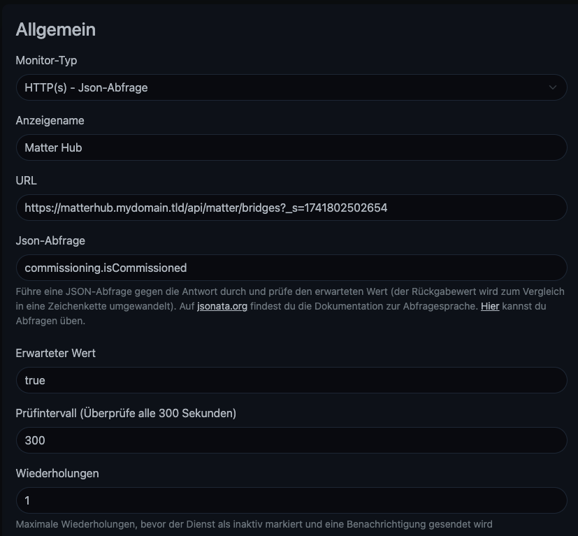
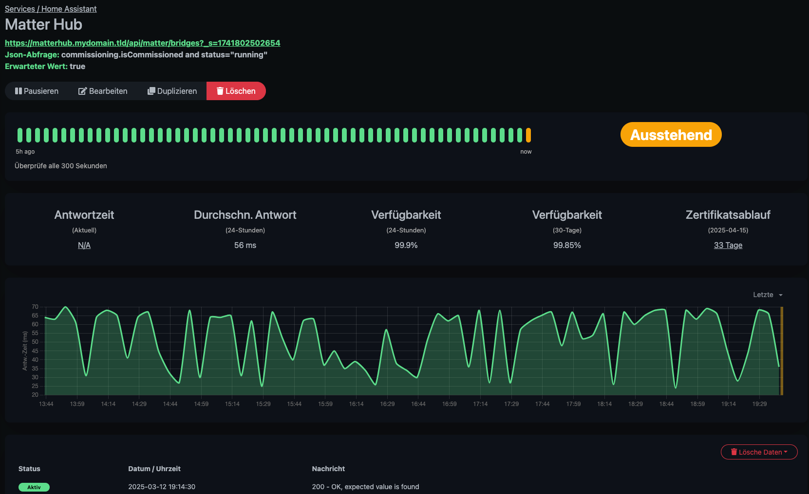
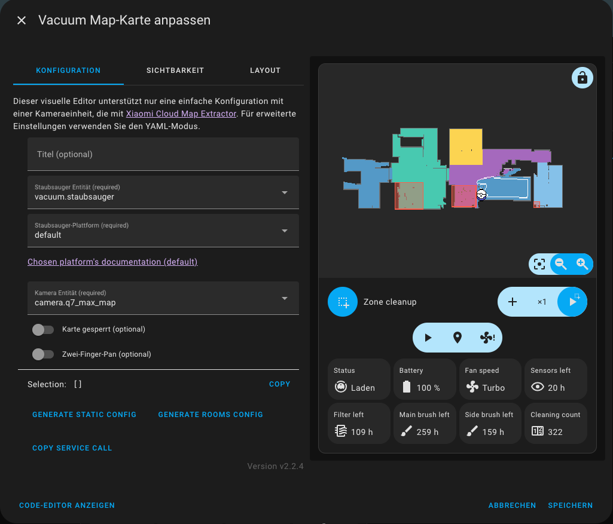
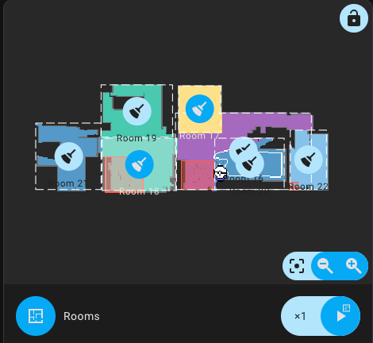
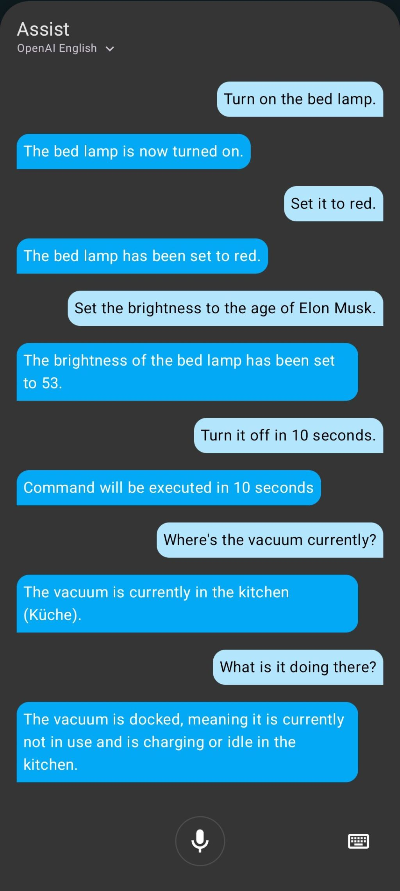
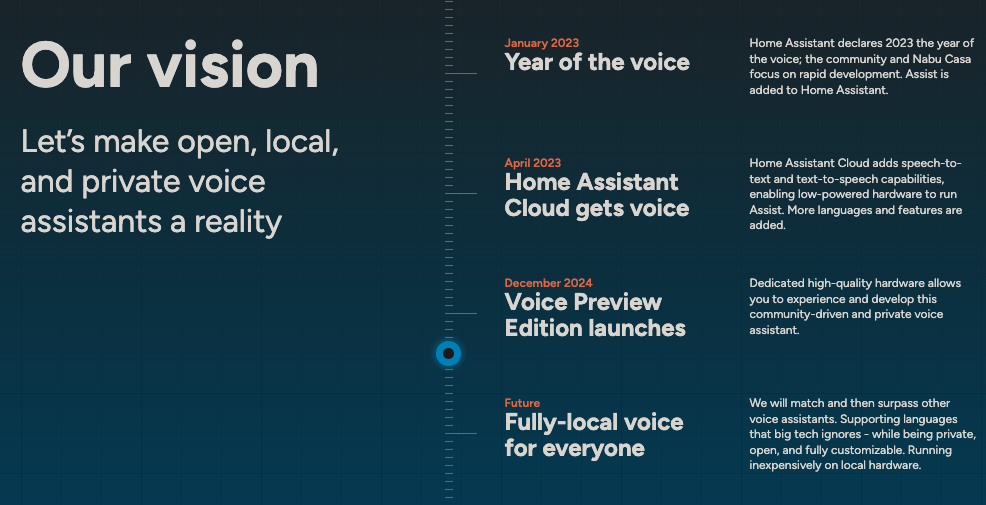

## Migration from openHAB to Home Assistant
In this blog post, I want to document my migration from the smart home system openHAB to Home Assistant.

## Table of contents

<!--ts-->
   * [Migration from openHAB to Home Assistant](#migration-from-openhab-to-home-assistant)
   * [Table of contents](#table-of-contents)
   * [Introduction to the systems](#introduction-to-the-systems)
      * [Similarities](#similarities)
      * [Differences](#differences)
   * [Introduction into my migration](#introduction-into-my-migration)
      * [Reasons to switch](#reasons-to-switch)
      * [Handling of devices in the two systems](#handling-of-devices-in-the-two-systems)
   * [Installation](#installation)
   * [Configuring Home Assistant](#configuring-home-assistant)
      * [The Home Assistant cloud](#the-home-assistant-cloud)
      * [Home Assistant Matter Hub](#home-assistant-matter-hub)
         * [Setup](#setup)
         * [Monitoring](#monitoring)
      * [Roborock Integration](#roborock-integration)
      * [Voice Assistants](#voice-assistants)
      * [Zigbee Network](#zigbee-network)
         * [Setup of passwords for MQTT](#setup-of-passwords-for-mqtt)
      * [The whole docker-compose.yml](#the-whole-docker-composeyml)
   * [Key takeaways](#key-takeaways)
   * [Future](#future)
   * [Sources and additional resources](#sources-and-additional-resources)
<!--te-->

## Introduction to the systems

openHAB and Home Assistant are both popular open-source platforms for smart home automation. Each aims to unify all your devices, sensors, and services under one centralized system, enabling you to manage them through a single interface and to build automations that span across different brands and protocols.

Despite sharing the same general goal, openHAB and Home Assistant offer distinct approaches. openHAB uses Java and the OSGi framework under the hood, reflecting its early focus on modularity. Home Assistant, on the other hand, is written mostly in Python, which makes adding custom logic or integrations more approachable for those who are familiar with that language. Both platforms feature vibrant communities that provide help, create plugins/add-ons, and continuously refine the software.

### Similarities
- Open Source & Community-Driven: Both openHAB and Home Assistant are entirely open source and rely on a large, enthusiastic user base. Contributors submit code, create extensions, and share best practices.
- Broad Device Compatibility: Each solution integrates with a vast array of protocols and manufacturers (Zigbee, Z-Wave, Wi-Fi, Bluetooth, etc.). This wide support ensures you can manage most of your smart home products in either system.
- Automation Focus: While the technical details differ, both platforms let you set up automations to trigger actions based on specific conditions (e.g., turning off all lights after midnight, adjusting thermostats on motion detection, etc.).

### Differences
- Architecture & Terminology: openHAB introduces the concepts of Things, Channels, and Items, while Home Assistant groups Devices into multiple Entities. This extra layer of abstraction in openHAB allows fine-grained linking between physical hardware and the items you manipulate in automations. In Home Assistant, you work more directly with entities tied to each device.
- Configuration & Scripting: openHAB historically employed the Rules DSL (though it now supports JRuby and
JavaScript-based automation), whereas Home Assistant encourages YAML configurations, Python-based scripting, and an
extensive web-based UI for advanced automations.
- Community Size & Pace: Both are active, but Home Assistant has grown swiftly in recent years, leading to very frequent releases and new features. openHAB also sees regular updates but tends to space them out more.

## Introduction into my migration

I've been using openHAB for some years now. As I recall I started using it when [version `2.2` was the latest one](https://www.openHAB.org/blog/2017-12-18-openHAB22.html), which was in December 2017. Since then, I have been using exclusively openHAB to control all my smart devices at home. Thus, I have picked up a lot of knowledge along the way and know my way around. I mostly have been happy with the system. However, there are some annoyances and caveats that led me to try out Home Assistant now.

To be honest, I tried the migration to Home Assistant a few years ago already. However, I did not finish it and had both systems running side by side. Since I did not have the time back then to finish the project, I ditched Home Assistant and came back to my trusted and known system. This time my goal is to re-setup Home Assistant and migrate fully to it.

openHAB is currently at version `4.3.3` and is about to release version `5`. At the time of writing this (March 2025), the maintainers are [discussing with the community wanted features](https://community.openHAB.org/t/ideas-and-discussion-what-features-do-you-want-in-openHAB-5-0/160573).

I have many smart lamps, four Amazon Echos, a robot vacuum, multiple motion sensors, two computers, a heating bed, a TV and a soundsystem. All these entities were in openHAB and had to be added to Home Assistant.

### Reasons to switch

I like openHAB and since I have used it for such a long time, I've become quite comfortable with it. However, there are some reasons why I wanted to try out Home Assistant:
 - Written in `Python`: Since I am a full-time **Python** developer, I like to take a look under the hood. For example, I worked with maintainers of openHAB to develop, maintain and fix some bindings. However, this is very limited as openHAB is written in `Java` and I don't feel that comfortable with it.
- Automations in openHAB: As I started to use openHAB in 2017, there were only the [DLS rules](https://www.openHAB.org/docs/configuration/rules-dsl.html), a proprietary language based on Java. Since then, they have released [JRuby Scripting](https://www.openHAB.org/addons/automation/jrubyscripting/) and [JS Scripting](https://www.openHAB.org/addons/automation/jsscripting/) as replacements. However, I never really come to pace with them. Since the DSL rules are pretty old, the syntax is quite clunky and limited.
  
  Often there have to be multiple conversions for simple things. For example, to determine weather now is before some point in time you have to write something like 
  ```java
  now.isBefore((Klima_System_Sonnenuntergang.state as DateTimeType).getZonedDateTime(ZoneId.systemDefault()))
  ```
  Or two check if the CPU temp is higher than a predefined value
  ```java
  val Number SystemTempSchwelle = 55
  if ((System_System_Metriken_CPU_Temperatur.state as Number).floatValue < SystemTempSchwelle) { return }
   ```
  Or set a timestamp to an item
  ```java
  Timer_Schlafzimmer_Heizdecke_Ende.sendCommand(DateTimeType.valueOf(now.plusMinutes(DauerInMinuten).toLocalDateTime().toString()))
  ```
 - Error messages in openHAB: When developing automations in openHAB, the error messages leave a lot to be desired. Often the following error message occurs:
   ```java
   [ERROR] [openHAB.core.automation.module.script.internal.handler.AbstractScriptModuleHandler] - Script execution of rule with UID 'Cronjob-2' failed: Could not invoke method: org.openHAB.core.model.script.actions.BusEvent.sendCommand(org.openHAB.core.items.Item,java.lang.String) on instance: null in Cronjob
   ```
   or
   ```java
   [ERROR] [openHAB.core.automation.module.script.internal.handler.AbstractScriptModuleHandler] - Script execution of rule with UID 'Sensoren_Badezimmer-2' failed: An error occurred during the script execution: Could not invoke method: java.lang.Integer.parseInt(java.lang.String) on instance: null in Sensoren_Badezimmer
   ```
   or
   ```java
   [ERROR] [openHAB.core.automation.module.script.internal.handler.AbstractScriptModuleHandler] - Script execution of rule with UID 'Sensoren_Flur-1' failed: cannot invoke method public boolean org.openHAB.core.model.script.actions.Timer.reschedule(java.time.ZonedDateTime) on null in Sensoren_Flur
   ```
   For some reason (which the error does not tell me) *something* in my automation is `null`. To debug this issue, you have to delete line by line in the automation to find the error since there is no other way to debug it.
 - Bugs in bindings: Bindings are integrations of other systems into openHAB. For example, you'd use the `Hue` binding to integrate your Philips Hue devices into openHAB. These binding sadly often have some bugs. Just as I opened the log of openHAB to find an error message for the example before, I am greeted with the whole source code of *some* integration and a stack trace at the bottom (which does not help to identify the culprit).
   
 - Bigger community: openHAB and Home Assistant are majorly community driven. With the larger amount of people contributing to Home Assistant there is simply more progress.
 
### Handling of devices in the two systems

To begin with, I have to introduce how the two systems depict real world devices. For that, we use the example of a lamp:

- openHAB
  - A device (like a lamp) is represented as a `Thing`. This encapsulates the physical device.
  - The `Thing` exposes its capabilities via `Channels`. For instance, one channel might control the on/off state while
    another manages brightness.
  - These `Channels` are then linked to `Items`, which serve as the interface for user interactions and automation rules.
- Home Assistant
  - A device (like a lamp) lamp is represented as a `Device` that groups its functionalities.
  - The `Device` contains one or more `Entities` that control properties such as on/off state and brightness. These
    `Entities` are directly accessible for automation and user interaction.

So there is one more abstraction layer in openHAB: the `Channel`s layer sits between the physical device (`Thing`) and the user interface/automation (`Item`).

Understanding this was crucial to work with Home Assistant.

## Installation

Home Assistant allows multiple ways of being installed:
 - Home Assistant Green: A little server that has the software pre-installed
 - Installing on own hardware: Installing the software barebones on a dedicated device
 - Containerized: Running the software in a container (e.g., by using Docker)

Since I run all my homelab software in a container and want all of it to run on my single server, I choose the containerized version of Home Assistant which I run using Docker.

Some installation guides advise against using the container as it is the _expert_ installation method. However, I had no problems whatsoever with using it:
```yaml
services:
    homeassistant:
        image: "ghcr.io/home-assistant/home-assistant:stable"
        container_name: homeassistant_app
        volumes:
            - ./data/homeassistant/config:/config
            - /etc/localtime:/etc/localtime:ro
            - /run/dbus:/run/dbus:ro
        restart: unless-stopped
        ports:
            - 11000:8123
```
Moreover, some docs say that using HACS, the `Home Assistant Community Store` which allows installation of custom integrations, is not possible using the container. However, this is just not true: As [stated in the docs](https://www.hacs.xyz/docs/use/download/download/#to-download-hacs-container) installation is as simple as running one script:
```sh
$ docker exec -it <name of the container running homeassistant> bash

wget -O - https://get.hacs.xyz | bash -
```

## Configuring Home Assistant

In the following section, I will write about noteworthy things I discovered that were not _trivial_ and might help you.

### The Home Assistant cloud

One thing I was afraid of before starting to use Home Assistant was the Home Assistant Cloud as it is not free like the openHAB cloud. The cloud connectors of both systems allow the devices configured in them to be accessible by Alexa, which is a hard requirement for me.

The cloud integration of Home Assistant costs 75 EUR per year ([depending on your location and currency](https://www.nabucasa.com/pricing/)), which is something I wanted to avoid.

Luckily, there is the [Home Assistant Matter Hub](https://github.com/t0bst4r/home-assistant-matter-hub) that allows to expose devices from Home Assistant using Matter to Alexa. This has two major advantages: _It does not use the cloud and it does not use the cloud_. Firstly, you don't have to pay the fee to use the cloud of Home Assistant. Secondly, all the communication is local and not depending on some cloud server. (When the internet is down at home, this still won't allow devices to be controlled by voice using Alexa since the speech to text recognition of Alexa still runs in the cloud. But it's a step in the right direction.)

The Home Assistant cloud has more features than only the voice service integration such as a remote connection, so you can access your Home Assistant instance on the go. However, since I have a VPN configured to my home network, I have no usage for that feature. Thus, using the Home Assistant Matter Hub allows me to ditch the cloud subscription entirely.

### Home Assistant Matter Hub

As stated before, I use the Home Assistant Matter Hub to expose the devices I want to be able to control with my voice to Alexa. As the integration uses Matter, it is not limited to the smart home system of Amazon but also integrates easily into Google Home and Apple Home.

#### Setup

Setup of the integration was quite easy by following the [documentation](https://t0bst4r.github.io/home-assistant-matter-hub/installation#id-2-manual-deployment). Since I use the containerized version of Home Assistant, I do not have access to Add-Ons. However, the integration allows to be used by deploying its own container:
```yaml
services:
    matter-hub:
        image: ghcr.io/t0bst4r/home-assistant-matter-hub
        container_name: homeassistant_matterhub
        restart: unless-stopped
        network_mode: host
        environment:
            - HAMH_HOME_ASSISTANT_URL=https://homeassistant.<mydomain>.tld
            - HAMH_HOME_ASSISTANT_ACCESS_TOKEN=${MATTER_HUB_ACCESS_TOKEN}
            - HAMH_LOG_LEVEL=info
            - HAMH_HTTP_PORT=11001
        volumes:
            - ./data/matter-hub:/data
```
Running the container exposed a Web interface on the port defined by the `HAMH_HTTP_PORT` variable. There you can `Create a new bridge`. The settings of a `bridge` are pretty simple:
- `Name`: The name of the bridge. This can be generic, I named mine `Matter Hub`.
- `Port` and `Country Code` can be left empty/set to the default.
- `Include`: This it where it is configured which devices are exposed to the voice assistant. I set the `Type` to `label` and the `Value` to `matterhub`.This ensures that all entities that have the aforementioned label are exposed. This way it is not necessary to choose the entities one by one in the Web UI of the matter hub. Instead, adding a simple label in Home Assistant is enough to expose them.

After configuring the bridge, it is sensible to choose some devices that shall be exposed to it. For this I created a label in Home Assistant called `MatterHub` (notice this can be uppercase but the setting of the matter bridge has to be lowercase) and added the label to the wanted entities:


As a last step, it is necessary to add the bridge to the voice system (in my case, Alexa). In the case of using Alexa, this is a matter of
1. Opening the Alexa app,
2. Switching the tab to `Devices`,
3. Adding a device by clicking on the `+` on the top right,
4. Scrolling down to `Other`,
5. Choosing `Matter`,
6. Taking a picture of the QR-Code presented on the top left of page of the bridge

   
7. Afterwards, all the devices will show up in the App and can be controlled via voice without the usage of the Home Assistant Cloud. Also, the Web UI shows that the connection was successful:

   
8. When adding new devices, I noticed that it is necessary to restart the integration in order for them to be picked up. This seems to be a bug in the current version (which is expected as this is an `alpha` release)

#### Monitoring

Since this integration is relatively new and still has some bugs, it sometimes requires a restart or some other kind of attention. To monitor if everything works as expected, I use [Uptime Kuma](https://github.com/louislam/uptime-kuma) which checks if the bridge is `running` and `comissioned`. This is done by crawling the API of the Matter Hub for the state of its bridge. I found the URL by taking using the developer tools and looking for the request to the URL starting by `/api/matter/bridges?_s=`. This request returns a JSON response containing the wanted information: `commissioning.isCommissioned and status="running"`. This can be checked by Uptime Kuma:




I also noticed that when starting the Matter Hub container at the same time as Home Assistant (which is the default case with dokcer compose), the Matter Hub does not start properly. This is due since the Matter Hub is unable to connect to Home Assistant and then fails. To combat this, I implemented a healthcheck for the Home Assistant container and let the Matter Hub container start up once the Home Assistant container is fully up and running:
```yml
services:
  homeassistant:
    image: ghcr.io/home-assistant/home-assistant:stable
    [...]
    healthcheck:
      test:
        [
          "CMD",
          "sh",
          "-c",
          "curl -s -H 'Authorization: Bearer ${CONTAINER_HEALTH_CHECK_ACCESS_TOKEN}' http://localhost:8123/api/config | jq -r '.state' | grep -E ^RUNNING",
        ]
      interval: 60s
      timeout: 5s
      retries: 3
      start_period: 90s
      start_interval: 5s
  matter-hub:
    image: ghcr.io/t0bst4r/home-assistant-matter-hub
    [...]
    depends_on:
      homeassistant:
        condition: service_healthy
```
This works by crawling the API of Home Assistant for its state and checks if it is `RUNNING`. Only after that is the case the Matter Hub starts up. The `${CONTAINER_HEALTH_CHECK_ACCESS_TOKEN}` is a long-lived access token that can be [created in the `Security` section of the user profile](https://community.home-assistant.io/t/how-to-get-long-lived-access-token/162159/5).

### Roborock Integration

A pain point I had with openHAB was the integration of my [Roborock Q7 Max Vacuum](https://de.roborock.com/pages/roborock-q7-max). It's a great vacuum, however, integrating it into third party systems has some quirks:
- There are two apps to control the vacuum: the `Xiaomi` app and the `Roborock` app. It is not clear to the user which one to use as they both offer the same functionality but look different and require different user credentials. Moreover, only one of them can be used at a time (the vacuum must be factory reset to set up in the other app). 
- Cleaning the whole apparent is pretty straightforward. However, a crucial part (at least for me) is cleaning only selected rooms. To achieve this, it is necessary to pass on a certain string of room ids. The vacuum returns a list of rooms via its API, and you have to figure out a way to send the correct ids to it. In openHAB I had to manually create a mapping
    ```text
    Office=19
    Bathroom=21
    Dining=17
    Corridor=20
    Kitchen=22
    Bedroom=18
    LivingRoom=16
    ```
  and individual items
    ```
    String			Vacuum_System_Vacuum_Command							{channel="miio:vacuum:Vacuum_System_Vacuum:actions#commands"}  
    Group:Number:COUNT(ON)	Vacuum_System_Room_Group	"Räume [%d]"
    Switch			Vacuum_System_Room_Office	"Office"	(Vacuum_System_Room_Group)
    Switch			Vacuum_System_Room_Bathroom	"Bathroom"	(Vacuum_System_Room_Group)
    Switch			Vacuum_System_Room_Dining	"Dining"	(Vacuum_System_Room_Group)
    Switch			Vacuum_System_Room_Corridor	"Corridor"	(Vacuum_System_Room_Group)
    Switch			Vacuum_System_Room_Kitchen	"Kitchen"	(Vacuum_System_Room_Group)
    Switch			Vacuum_System_Room_Bedroom	"Bedroom"       (Vacuum_System_Room_Group)
    Switch			Vacuum_System_Room_LivingRoom	"LivingRoom"    (Vacuum_System_Room_Group)
    Switch			Vacuum_System_Start		"Start"			
    ```
  and a rule
    ```
    rule "Clean in selected rooms"
    when
        Item Vacuum_System_Start changed to ON
    then
        val String RuleName = Filename + ": \"Clean in selected rooms\": "
    
        val ids = Vacuum_System_Room_Group
            .members
            .filter[ room | room.state == ON ]
            .map[ name.replace("Vacuum_System_Room_", "") ]
            .map[ name | transform("MAP", "VacuumRooms.map", name) ]
            .join(", ")
        val Command = "app_segment_clean[{\"segments\": [" + ids + "]}]"
    
        logInfo("Rule triggered", RuleName + Command)
        Vacuum_System_Vacuum_Command.sendCommand(Command)
    
        Thread.sleep(10)
    
        Vacuum_System_Room_Group.members.forEach[ item | item.postUpdate(OFF) ]
        Vacuum_System_Start.postUpdate(OFF)
    end
    ```

Fortunately, the setup of my vacuum was pretty easy in Home Assistant:
1. Set up the vacuum in the **Roborock** App.
2. Install the Roborock integration from GitHub: https://github.com/humbertogontijo/homeassistant-roborock. The docs say that _It is recommended you switch to the core version of this integration._ However, only this version (in contrast to the one of the core) is able to extract the map of the appartement.
3. Login in the newly installed Roborock integration. Afterwards, it will automatically add all the discovered vacuums to your system.
4. Afterwards, you can add the `Vacuum Map Card` to your dashboard

   
5. Click `Generate Rooms Config`. This will parse the list of the available rooms provided by the API. Moreover, it will create rectangles in the map view that show the corresponding rooms. These then can be selected and cleaned individually.

   
6. By opening the code editor, you can change the icons of the rooms and their labels. E.g. 
    ```yml
    predefined_selections:
      - id: "16"
        icon:
          name: mdi:broom
          x: 26775
          "y": 26400
        label:
          text: Room 16
          x: 26775
          "y": 26400
          offset_y: 35
        outline:
          - - 23400
            - 24500
          - - 30150
            - 24500
          - - 30150
            - 28300
          - - 23400
            - 28300
    ```
   can be changed to
    ```yml
    predefined_selections:
      - id: "16"
        icon:
          name: mdi:sofa
          x: 26775
          "y": 26400
        label:
          text: living room
          x: 26775
          "y": 26400
          offset_y: 35
        outline:
          - - 23400
            - 24500
          - - 30150
            - 24500
          - - 30150
            - 28300
          - - 23400
            - 28300
    ```
   If you want, you can remove the labels entirely since the room is represented by its icon. My finished setup looks like this:

   

### Voice Assistants

Something that frustrates me a lot is my voice assistant Alexa. In the years of using her, I noticed that she is *just plain stupid*. She gets basic stuff wrong all the time and can't answer basic questions. Once I tried switching all my voice assistants to Google Home and was quite happy with it for a time. The smart assistant of Google is way smarter than the one of Amazon. However, 90 % of the time I just want to control my smart home devices and for that Alexa is better as her response times are way lower. Asking Google Home to control a device takes 3 to 10 seconds, using Alexa this task is done in 1 to 2 seconds. Moreover, Google removed the integration for third party shopping lists, thus eliminating the possibility to add something to my shopping cart, which is a feature I use daily in the kitchen.

On 02/26/2025 [Amazon announced _Alexa+_](https://www.youtube.com/watch?v=YYbAJ2nh25M), which integrates LLMs into Alexa. The functionality seems to be greatly improved judging by the trailer. However, there are three concerns:
- Price: _Alexa+_ will probably not be free and come with a monthly subscription.
- Availability: It is unclear when _Alexa+_ comes to my home country (Germany). It is rumored to be late 2025, but noone knows.
- Privacy: Confidentiality was always something to be concerned about when allowing company access to your personal home. There was one sentence in the trailer that struck out: 
  
  _Person asks: Wait, did someone let the dog out today?_

  _Alexa answers: I checked the cameras and yes, in fact <dogname> was just out._

  This sentence raised a lot of eyebrows. Someone of my favorite comments from the trailer:
  - _"I checked the cameras" 🚩 is a No No_
  - _Paying a subscription for this privacy nightmare [is] wild._
  - _This would've been impressive a few years ago, but it's good that Amazon is not too far behind._
  - _finally alexa also integrated chatgpt api_

The Home Assistant community did (in contrast to the developers of Alexa) stand still in the past. [2023 was Home
Assistant's year of Voice](https://www.home-assistant.io/blog/2022/12/20/year-of-voice/) which had some great improvements regarding this. It is now possible to control all devices in Home Assistant with the _Assist_. Assist is a
text-based dialog that allows the user to interact with its smart home. This is completely local, and lightning fast (sub 0.5 second time until the action was executed).

This is pretty great but can be elevated to the next level by adding a LLM to it. For that, I am using the [OpenAI conversation](https://www.home-assistant.io/integrations/openai_conversation) integration. This way I can interact with my smart home as I would with a human:

This currently works on my phone and computer.

There are two steps I want to tackle in the future:
- Replace OpenAI with a local running model: I'd like to run some model locally (like llama with [Ollama](https://ollama.com/)) to not be dependent on OpenAI and my internet access and have all data locally. For this, sadly, my current home server is too weak and has not enough memory. So to do this, I will have to get an upgrade at some point in the future.
- Replace my Alexas with other Hardware: Home Assistant just launched (February 2025) the [Voice PE](https://www.home-assistant.io/voice-pe/) which is a replacement for such voice assistants. Using it combined with a local running LLM would allow me to have my voice assistant entirely local, without any internet access. This ensures uptime during internet outages and privacy of all my data.
  
  Another promising option is the [Satellite1](https://futureproofhomes.net/) by FutureProofHomes that has similar features.

  I will give the Home Assistant team and other developers some time to iterate on the Hardware a bit further to make it more polished, improve the German support and add Spotify Connect integration. But I am certain that I will replace all my Alexas with other Hardware at the end of 2025 or at the beginning of 2026. 


### Zigbee Network

While switching to Home Assistant, I decided to also work on the reliability of my devices. In the past, I had many problems with devices being unresponsive, and there is few that is more frustrating when you want to go to bed in the evening, and the light just won't turn off. Thus, I had the goal to increase the reliability of my devices. For this, I wanted to use a Mesh Network such that all devices can communicate with each other. 

There are two main options when it comes to Mesh Networks in the smart home sector: Thread and Zigbee. Thread is newer than Zigbee. However, there are many more devices compatible with Zigbee than Thread. Since I wanted to be able to choose from a wide variety of devices and manufactures, I decided to go with Zigbee.

After some research, I decided to by the [Sonoff Zigbee 3.0 USB Dongle Plus](https://sonoff.tech/product/gateway-and-sensors/sonoff-zigbee-3-0-usb-dongle-plus-e/). This is a product reviewed, recommended and trusted and by many. Moreover, it is one of the recommended devices in the [Home Assistant docs](https://www.home-assistant.io/integrations/zha/#recommended-zigbee-radio-adapters-and-modules).

When using Zigbee with Home Assistant, there are two major integrations to choose from: Zigbee Home Automation (ZHA) and Zigbee2MQTT.

Both support connecting devices via Zigbee to Home Assistant, and they offer very similar functionality. ZHA is a native Home Assistant integration that provides a straightforward setup and management experience, making it ideal for users who want a simpler, more direct approach. Zigbee2MQTT relies on an external MQTT broker, offering broader device compatibility and advanced customization options, which can appeal to those seeking deeper control over their Zigbee network.

**Firstly** I chose to go with ZHA since I was working with two (for me) new technologies (Home Assistant and Zigbee), and I didn't want to add any complexity by adding MQTT to that. I installed the integration as described in the [docs](https://www.home-assistant.io/integrations/zha/#configuration), connected my devices and was pretty happy.

However, I had a problem with my Philips Hue motion sensors that I connected via ZHA: The timeout of them was set to 5 minutes and not changeable. So, when they stopped to detect motion, it took 5 minutes for the device in Home Assistant to report no further movement. This was a dealbreaker for me as I wanted to build some automations that turn the light off after *only* 30s of no movement. After [asking in the community forum](https://community.home-assistant.io/t/cooldown-time-of-hue-motion-sensor-using-zha/863210) and not getting a helpful response and finding out that is possible to configure that timeout in Zigbee2MQTT I decided to try Zigbee2MQTT.

While I was worried that the setup would be a huge hassle, it turned out to be quite the opposite. To use Zigbee2MQTT in Home Assistant Zigbee2MQTT and the MQTT broker can be setup as an Add-On. However, since I use the containerized version of Home Assistant, I can't use Add-Ons. Fortunately setting both of them as their own containers up is really easy. I started by updating my docker-compose.yml:
```yml
services:
    homeassistant:
        image: ghcr.io/home-assistant/home-assistant:stable
        [...]
        depends_on:
            - mosquitto
    zigbee2mqtt:
        image: koenkk/zigbee2mqtt
        container_name: homeassistant_zigbee2mqtt
        restart: unless-stopped
        volumes:
            - ./data/zigbee2mqtt:/app/data
            - /run/udev:/run/udev:ro
        ports:
            - 11002:8080
        environment:
            - TZ=Europe/Berlin
        devices:
            - /dev/serial/by-id/usb-ITead_Sonoff_Zigbee_3.0_USB_Dongle_Plus_[...]:/dev/ttyUSB0
        depends_on:
            - mosquitto
    mosquitto:
        image: eclipse-mosquitto
        container_name: homeassistant_mosquitto
        restart: unless-stopped
        volumes:
            - ./data/mosquitto/config:/mosquitto/config
        environment:
            TZ: Europe/Berlin
```
It is recommended to use the path of the id of the Zigbee dongle instead of just `dev/ttyUSB0` as a source since the path of the dongle may change after a short connection loss to e.g. `dev/ttyUSB1`. By using the id the mapping always works.

I created the `mosquitto.conf` in `./data/mosquitto/config/` which is all the interaction that is to be had with it (no further configuration required):
```text
listener 1883
socket_domain ipv4
allow_anonymous true
```

Afterwards, I created the `configuration.yaml` in `/data/zigbee2mqtt/`:
```yaml
version: 4
homeassistant:
  enabled: true
frontend:
  enabled: true
mqtt:
  base_topic: zigbee2mqtt
  server: mqtt://mosquitto:1883
serial:
  port: /dev/ttyUSB0
  adapter: zstack
  baudrate: 115200
```

After running `docker compose up -d` Zigbee2MQTT is available at the specified port. There devices can be added. To do this, they have to be factory reset and the discovery mode has to be turned on. Factory resetting the devices is usually done by pressing a button or turning power on and off multiple times (this just depends on the device).

When I added by Philips Hue motion sensors I was pretty happy that I am able to configure the timeout in the settings of the devices. Moreover, it is possible to access the other settings of devices (such as the turn-on behavior after a power restore for my lamps). These are settings I was unable to set in ZHA, which is why I recommend using Zigbee2MQTT. It may sound like a lot more effort to setup, but it is just a few straightforward steps that may bring significant advantages with it.

Adding the devies to Home Assistant is as simple as installing the MQTT integration (no Zigbee integration required as the whole communication between Zigbee2MQTT and Home Assistant is over MQTT) and setting up the URL of the MQTT broker. In my case the hostname is the container name and the port is the default one: `mqtt://mosquitto:1883`. After that, all the devices appear in Home Assistant and are ready to use.

#### Setup of passwords for MQTT

In the setup above there is no authentication required to connect to the MQTT broker. To change this you have to first create a `passwordfile` which contains the username and credentials of the available users. I chose to create two users (one for Zigbee2MQTT and one for Home Assistant). To do this I ran these commands in the Mosquitto container:
```txt
# cd mosquitto/config/
# mosquitto_passwd -c passwordfile zigbee2mqtt
Password: <pw1>
Reenter password: <pw1>
# mosquitto_passwd -b passwordfile homeassistant <pw2>
```
This creates the password file which then can be setup in the `mosquitto.conf`.

Afterwards all three softwares must be reconfigured:
1. Change the `mosquitto.conf` to
    ```text
    listener 1883
    socket_domain ipv4
    password_file /mosquitto/config/passwordfile
    ```
2. Change the `mqtt` part of the `configuration.yaml`of Zigbee2MQTT to
    ```yaml
    mqtt:
      base_topic: zigbee2mqtt
      server: mqtt://mosquitto:1883
      keepalive: 60
      password: <pw1>
      user: zigbee2mqtt
      reject_unauthorized: true
      version: 4
    ```
3. Restart the containers
4. Set the new password in Home Assistant by going to the confiuration of the MQTT integration.

### The whole `docker-compose.yml`

Here you can find my whole `docker-compose.yml` as I only showed the relevant parts of the section above:
```yml
services:
    homeassistant:
        image: ghcr.io/home-assistant/home-assistant:stable
        container_name: homeassistant_app
        volumes:
            - ./data/homeassistant/config:/config
            - /etc/localtime:/etc/localtime:ro
            - /run/dbus:/run/dbus:ro
        restart: unless-stopped
        ports:
            - 11000:8123
        healthcheck:
            test:
                [
                    "CMD",
                    "sh",
                    "-c",
                    "curl -s -H 'Authorization: Bearer ${CONTAINER_HEALTH_CHECK_ACCESS_TOKEN}' http://localhost:8123/api/config | jq -r '.state' | grep -E ^RUNNING",
                ]
            interval: 60s
            timeout: 5s
            retries: 3
            start_period: 90s
            start_interval: 5s
        depends_on:
            - mosquitto
    matter-hub:
        image: ghcr.io/t0bst4r/home-assistant-matter-hub
        container_name: homeassistant_matterhub
        restart: unless-stopped
        network_mode: host
        environment:
            - HAMH_HOME_ASSISTANT_URL=https://homeassistant.<mydomain>.<tld>
            - HAMH_HOME_ASSISTANT_ACCESS_TOKEN=${MATTER_HUB_ACCESS_TOKEN}
            - HAMH_LOG_LEVEL=info
            - HAMH_HTTP_PORT=11001
        volumes:
            - ./data/matter-hub:/data
        depends_on:
            homeassistant:
                condition: service_healthy
    zigbee2mqtt:
        image: koenkk/zigbee2mqtt
        container_name: homeassistant_zigbee2mqtt
        restart: unless-stopped
        volumes:
            - ./data/zigbee2mqtt:/app/data
            - /run/udev:/run/udev:ro
        ports:
            - 11002:8080
        environment:
            - TZ=Europe/Berlin
        devices:
            - /dev/serial/by-id/usb-ITead_Sonoff_Zigbee_3.0_USB_Dongle_Plus_928f1faaca3aef118b45301455516304-if00-port0:/dev/ttyUSB0
        depends_on:
            - mosquitto
    mosquitto:
        image: eclipse-mosquitto
        container_name: homeassistant_mosquitto
        restart: unless-stopped
        volumes:
            - ./data/mosquitto/config:/mosquitto/config
        environment:
            TZ: Europe/Berlin
```

## Key takeaways

- The migration from openHAB to Home Assistant takes time: It took me multiple weeks to do the whole migration as these are two systems that are in the same domain but do have quite a few differences. What worked well for me is to
  1. Start Home Assistant and leave the _old_ system running at the same time
  2. Add all the devices to Home Assistant
  3. Create a dashboard to control the devices
  4. Migrate one automation after the other to Home Assistant
  5. Decommission the _old_ system
  
  This way you don't have any temporal pressure to finish the migration and can fall back to the _old_ system when something is not yet implemented in the _new_ system. 
- Don't buy **any** hardware that relies on UDP (or similar protocols without ACKs): I bought these nice ceiling lights from Govee. They produce awesome light and look nice. However, they only have a local API that only supports UDP. Thus, you never know whether the lamp received the command you sent it. Moreover, the lamp randomly and often deconnects from the network and thus is completely unresponsive.
  
  I am really happy with my usage of Zigbee. It works really well since it uses a mesh network technology and can fully recommend it!

## Future

There are some things I want to set up/change/replace in the future which I have not come around to do so just yet:
- Local LLMs: As described in the [Voice Assistants](#voice-assistants) section, I'd like to replace the dependency of OpenAI with a local LLM running on my server at home. Currently, the server is not equipped with sufficient hardware, but I will upgrade that in the future. 
- Replace all Alexas with other Hardware: As described in the [Voice Assistants](#voice-assistants) section, I'd like to
  replace all my voice assistants with a privacy focussed community driven Hardware.
- Improve my dashboard: The dashboard is subject to constant change as hardware is switched out and new automations and integrations get added. From my experience with openHAB in the past years, I have learned that the dashboard is never finished and gets iterated on all the time. However, in a perfect world, I would not need it as the home does most of it on its own and is controlled primarily through voice by the user(s).

## Sources and additional resources

- German YouTuber that explains details of Home Assistant and tangent technologies like Zigbee, Matter and Thread very well: [Simon42](https://www.youtube.com/@simon42)
  - [Video about Thread](https://youtu.be/aAl7pK6F7Tw)
  - [Video about Matter Hub](https://youtu.be/yOkPzEzuVhM)
  - [Video about ZHA vs. Zigbee2MQTT](https://youtu.be/j7Lq7ylLtZU)
- [Installation docs of Home Assistant](https://www.home-assistant.io/installation/)
- [Installation docs of HACS](https://www.hacs.xyz/docs/use/download/download/#to-download-hacs-container)
- [Installation docs of Home Assistant Matter Hub](https://t0bst4r.github.io/home-assistant-matter-hub/)
- [Home Assistant Blog: Year of Voice](https://www.home-assistant.io/blog/2022/12/20/year-of-voice/)
- [How to create a long-lived access token](https://community.home-assistant.io/t/how-to-get-long-lived-access-token/162159/5?u=felixschneider)
- [Home Assistant Voice PE](https://www.home-assistant.io/voice-pe/)
- [Satellite1](https://futureproofhomes.net/)
