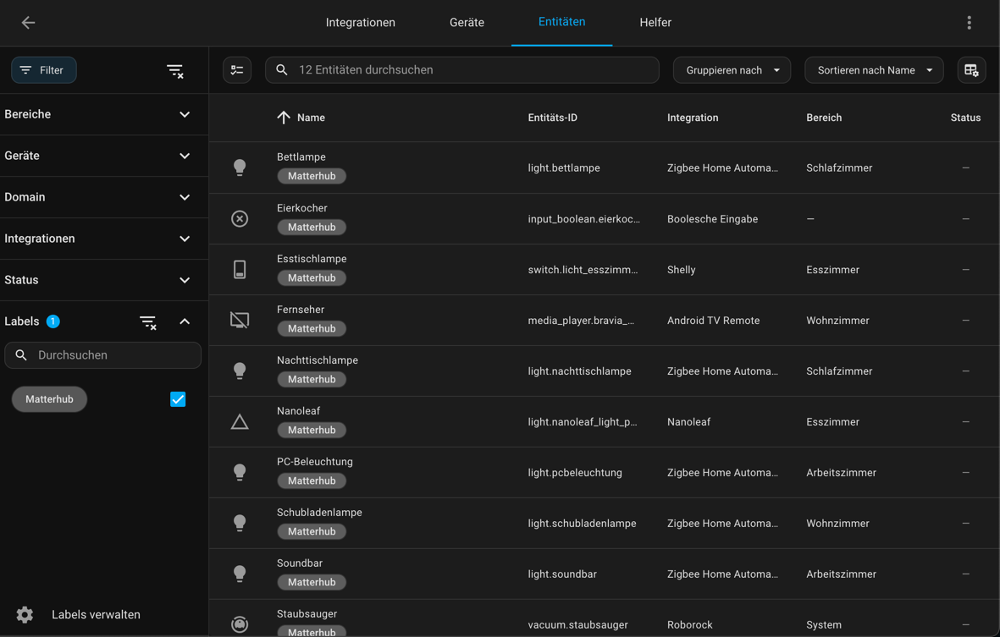
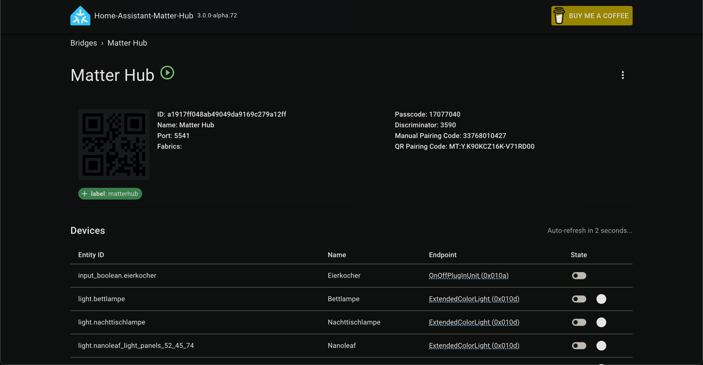
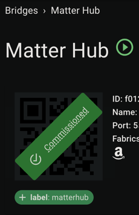

# Migration from openHAB to Homeassistant
In this blog post, I want to document my migration from the smart home system openHAB to Home Assistant.

## Introduction

I've been using openHAB for some years now. As I recall I started using it when [version `2.2` was the latest one](https://www.openhab.org/blog/2017-12-18-openhab22.html), which was in December 2017. Since then, I have been using exclusively openHAB to control all my smart devices at home. Thus, I have picked up a lot of knowledge along the way and know my way around. I mostly have been happy with the system. However, there are some annoyances and caveats that led me to try out Home Assistant now.

To be honest, I tried the migration to Home Assistant a few years ago already. However, I did not finish it and had both systems running side by side. Since I did not have the time back then to finish the project, I ditched Home Assistant and came back to my trusted and known system. This time my goal is to re-setup Home Assistant and migrate fully to it.

openHAB is currently at version `4.3.3` and is about to release version `5`. At time of writing this (March 2025) the maintainers are [discussing with the community wanted features](https://community.openhab.org/t/ideas-and-discussion-what-features-do-you-want-in-openhab-5-0/160573).

## Reasons to switch

I like openHAB and since I have used it for such a long time, I've become quite comfortable with it. However, there are some reasons why I wanted to try out Home Assistant:
 - Written in `Python`: Since I am a full-time **Python** developer, I like to take a look under the hood. For example I worked with maintainers of openHAB to develop, maintain and fix some bindings. However, this is very limited as openHAB is written in `Java` and I don't feel that comfortable with it.
- Automations in openHAB: As I started to use openhab in 2017 there were only the [DLS rules](https://www.openhab.org/docs/configuration/rules-dsl.html), a proprietary language based on Java. Since then, they released [JRuby Scripting](https://www.openhab.org/addons/automation/jrubyscripting/) and [JS Scripting](https://www.openhab.org/addons/automation/jsscripting/) as replacements. However, I never really come to pace with them. Since the DSL rules are pretty old, the syntax is quite clunky and limited.
  
  Often there have to be multiple conversions for simple things. For example, to determine weather now is before some point in time you have to write something like 
  ```java
  now.isBefore((Klima_System_Sonnenuntergang.state as DateTimeType).getZonedDateTime(ZoneId.systemDefault()))
  ```
  Or two check if the CPU temp is higher than a predefined value
  ```java
  val Number SystemTempSchwelle = 55
  if ((System_System_Metriken_CPU_Temperatur.state as Number).floatValue < SystemTempSchwelle) { return }
   ```
  Or set a timestamp to an item
  ```java
  Timer_Schlafzimmer_Heizdecke_Ende.sendCommand(DateTimeType.valueOf(now.plusMinutes(DauerInMinuten).toLocalDateTime().toString()))
  ```
 - Error messages in openHAB: When developing automations in openHAB the error messages leave a lot to be desired. Often the following error message occurs:
   ```java
   [ERROR] [openhab.core.automation.module.script.internal.handler.AbstractScriptModuleHandler] - Script execution of rule with UID 'Cronjob-2' failed: Could not invoke method: org.openhab.core.model.script.actions.BusEvent.sendCommand(org.openhab.core.items.Item,java.lang.String) on instance: null in Cronjob
   ```
   or
   ```java
   [ERROR] [openhab.core.automation.module.script.internal.handler.AbstractScriptModuleHandler] - Script execution of rule with UID 'Sensoren_Badezimmer-2' failed: An error occurred during the script execution: Could not invoke method: java.lang.Integer.parseInt(java.lang.String) on instance: null in Sensoren_Badezimmer
   ```
   or
   ```java
   [ERROR] [openhab.core.automation.module.script.internal.handler.AbstractScriptModuleHandler] - Script execution of rule with UID 'Sensoren_Flur-1' failed: cannot invoke method public boolean org.openhab.core.model.script.actions.Timer.reschedule(java.time.ZonedDateTime) on null in Sensoren_Flur
   ```
   For some reason (which the error does not tell me) *something* in my automation is `null`. To debug this issue, you have to delete line by line in the automation to find the error since there is no other way to debug it.
 - Bugs in bindings: Bindings are integrations of other systems into openHAB. For example, you'd use the `Hue` binding to integrate your Philips Hue devices into openhab. These binding sadly often have some bugs. Just as I opened the log of openHAB to find an error message for the example before, I am greeted with the whole source code of *some* integration and a stack trace at the bottom (which does not help to identify the culprit).
   
 

## Handling of devices in the two systems

To begin with, I have to introduce how the two systems depict real world devices. For that, we use the example of a lamp:

- openHAB
  - A device (like a lamp) is represented as a `Thing`. This encapsulates the physical device.
  - The `Thing` exposes its capabilities via `Channels`. For instance, one channel might control the on/off state while
    another manages brightness.
  - These `Channels` are then linked to `Items`, which serve as the interface for user interactions and automation rules.
- Home Assistant
  - A device (like a lamp) lamp is represented as a `Device` that groups its functionalities.
  - The `Device` contains one or more `Entities` that control properties such as on/off state and brightness. These
    `Entities` are directly accessible for automation and user interaction.

So there is one more abstraction layer in openHAB: the `Channel`s layer sits between the physical device (`Thing`) and the user interface/automation (`Item`).

Understanding this was crucial to work with Home Assistant.

## Starting point

TODO

## Installation method

Home Assistant allows multiple ways of being installed:
 - Home Assistant Green: A little server that has the software pre-installed
 - Installing on own hardware: Installing the software barebones on a dedicated device
 - Containerized: Running the software in a container (e.g., by using Docker)

Since I run all my homelab software in a container and want all of it to run on my single server, I choose the containerized version of Home Assistant which I run using Docker.

Some installation guides advise against using the container as it is the _expert_ installation method. However I had to problems whatsoever with using it:
```yaml
services:
    homeassistant:
        image: "ghcr.io/home-assistant/home-assistant:stable"
        container_name: homeassistant_app
        volumes:
            - ./data/homeassistant/config:/config
            - /etc/localtime:/etc/localtime:ro
            - /run/dbus:/run/dbus:ro
        restart: unless-stopped
        ports:
            - 11000:8123
```
Moreover, some docs say that using HACS, the `Home Assistant Community Store` which allows installation of custom integrations, is not possible using the container. However, this is just not true: As [stated in the docs](https://www.hacs.xyz/docs/use/download/download/#to-download-hacs-container) installation is as simple as running one script:
```sh
$ docker exec -it <name of the container running homeassistant> bash

wget -O - https://get.hacs.xyz | bash -
```

## The Home Assistant cloud

One thing I was afraid of before starting to use Home Assistant was the Home Assistant Cloud as it is not free like the openHAB cloud. The cloud connectors of both systems allow the devices configured in them to be accessible by Alexa, which is a hard requirement for me.

The cloud integration of Home Assistant costs 75 EUR per year ([depending on your location and currency](https://www.nabucasa.com/pricing/)) which is something I wanted to avoid.

Luckily, there is the [Home Assistant Matter Hub](https://github.com/t0bst4r/home-assistant-matter-hub) that allows to expose devices from Home Assistant using Matter to Alexa. This has two major advantages: _It does not use the cloud and it does not use the cloud_. Firstly, you don't have to pay the fee to use the cloud of Home Assistant. Secondly, all the communication is local and not depending on some cloud server. (When the internet is down at home this still won't allow devices to be controlled by voice using Alexa since the speech to text recognition of Alexa still runs in the cloud, but it's a step in the right direction.)

The Home Assistant cloud has more features than only the voice service integration such as a remote connection, so you can access your Home Assistant instance on the go. However, since I have a VPN configured to my home network, I have no usage for that feature. Thus, using the Home Assistant Matter Hub allows me to ditch the cloud subscription entirely.

## Home Assistant Matter Hub

As stated before, I use the Home Assistant Matter Hub to expose the devices I want to be able to control with my voice to Alexa. As the integration uses Matter, it is not limited to the smart home system of Amazon but also integrates easily into Google Home and Apple Home.

### Setup

Setup of the integration was quite easy by following the [documentation](https://t0bst4r.github.io/home-assistant-matter-hub/installation#id-2-manual-deployment). Since I use the containerized version of Home Assistant I do not have access to Add-Ons. However, the integration allows to be used by deploying its own container:
```yaml
services:
    matter-hub:
        image: ghcr.io/t0bst4r/home-assistant-matter-hub
        container_name: homeassistant_matterhub
        restart: unless-stopped
        network_mode: host
        environment:
            - HAMH_HOME_ASSISTANT_URL=https://homeassistant.<mydomain>.tld
            - HAMH_HOME_ASSISTANT_ACCESS_TOKEN=${MATTER_HUB_ACCESS_TOKEN}
            - HAMH_LOG_LEVEL=info
            - HAMH_HTTP_PORT=11001
        volumes:
            - ./data/matter-hub:/data
```
Running the container exposed a Web interface on the port defined by the `HAMH_HTTP_PORT` variable. There you can `Create a new bridge`. The settings of a `bridge` are pretty simple:
- `Name`: The name of the bridge. This can be generic, I named mine `Matter Hub`.
- `Port` and `Country Code` can be left empty/set to the default.
- `Include`: This it where it is configured which devices are exposed to the voice assistant. I set the `Type` to `label` and the `Value` to `matterhub`.This ensures that all entities that have the aforementioned label are exposed. This way it is not necessary to choose the entities one by one in the Web UI of the matter hub. Instead, adding a simple label in Home Assistant is enough to expose them.

After configuring the bridge it is sensible to choose some devices that shall be exposed to it. For this I created a label in Home Assistant called `MatterHub` (notice this can be uppercase but the setting of the matter bridge has to be lowercase) and added the label to the wanted entities:



As a last step it is necessary to add the bridge to the voice system (in my case Alexa). In the case of using Alexa this is a matter of
1. Opening the Alexa app,
2. Switching the tab to `Devices`,
3. Adding a device by clicking on the `+` on the top right,
4. Scrolling down to `Other`,
5. Choosing `Matter`
6. Taking a picture of the QR-Code presented on the top left of page of the bridge

   
7. Afterwards, all the devices will show up in the App and can be controlled via voice without the usage of the Home Assistant Cloud. Also the Web UI shows that the connection was successful:

   

## Additional resources and sources

- German YouTuber that explains details of Home Assistant and tangent technologies like Zigbee, Matter and Thread very well: [Simon42](https://www.youtube.com/@simon42)
  - [Video about Thread](https://youtu.be/aAl7pK6F7Tw?si=kZ1THs3y1RpODWXS)
  - [Video about Matter Hub](https://youtu.be/yOkPzEzuVhM?si=bjSXb0L0qWeGX56O)
  - [Video about ZHA vs. Zigbee2MQTT](https://youtu.be/j7Lq7ylLtZU?si=gtjgpWL-Ma7sHRR2)
- [Installation docs of Home Assistant](https://www.home-assistant.io/installation/)
- [Installation docs of HACS](https://www.hacs.xyz/docs/use/download/download/#to-download-hacs-container)
- [Installation docs of Home Assistant Matter Hub](https://t0bst4r.github.io/home-assistant-matter-hub/)
